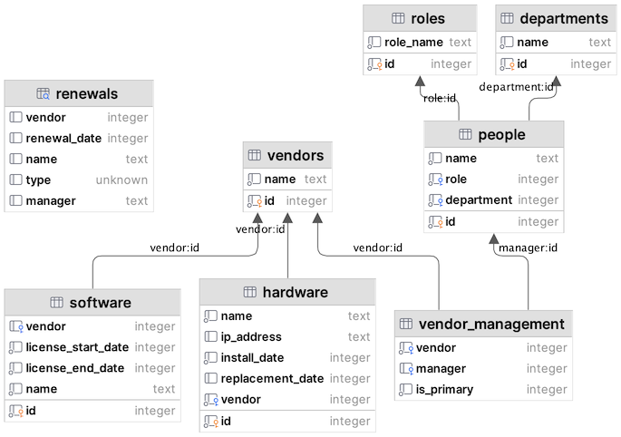

# KmmProDatabases
Companion exercise for SqlDelight training.  For reference, this is the planned schema we will be
migrating from Room to SqlDelight.

> ## Learn More!
>
> This sample exercise is part of Touchlab Pro. To learn more about the self-guided study, knowledge bank, and additional support we offer, [contact us here](https://form.typeform.com/to/jCsghkEP)!
